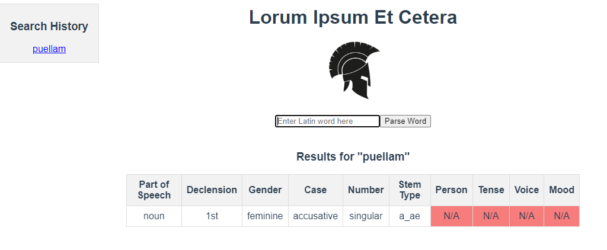

# Latin Parser App

#### Technologies Used
- Springboot with Kotlin and Maven
- Vue3 with JavaScript
- Perseids web API

This application will take any legitimate form of a Latin word and return parsing information. For example, it will tell you that the word puellam is a singular, feminine noun from the first declension in the accusative case. If the input has more than one possible way to parse it, all possibilities will be returned.

The working title for the app *Lorum Ipsum Et Cetera* is just a play on the same *lorum ipsum* phrase used now mostly for filler text and *et cetera* (more commonly seen as etc.). There is no deeper meaning.

Future iterations of this app may include a searchable dictionary as well as automated generation of noun and verb charts.

## Inspiration
This application is a true passion project for the sake of refining my technical skills as well as revisiting one of my past lives. Like the Romans themselves and their *mos maiorum*, I'm deeply endebted to those who've preceeded me in this oddly specific intersection of technology and classical linguistics.

- [Latin Word Study Tool](https://www.perseus.tufts.edu/hopper/morph?l=chartis&la=la) - online Latin word parser with Lewis & Short Latin dictionary, affiliated with Tufts University
- [SPQR mobile app](https://apps.apple.com/us/app/spqr-latin-dictionary-and-reader/id407340562) -  mobile word parser with extensive Latin dictionary, developed by Paul Hudson

## Latin Language Terminology Crash Course

**Cases** - the endings on a noun, adjective, or participle that determine how they function in a sentence (subject, direct object, possession, etc.)

**Declensions** - categories of endings for cases

**Person** - 1st, 2nd, or 3rd person for verbs (I, you, he/she/it, we, you all, they)

**Number** - singular or plural

**Gender** - grammatical gender of a noun, adjective, or participle (masculine, feminine, neuter)

**Voice** - active or passive voice for verbs and participles

**Mood** - indicative, subjunctive, or imperative mood for verbs